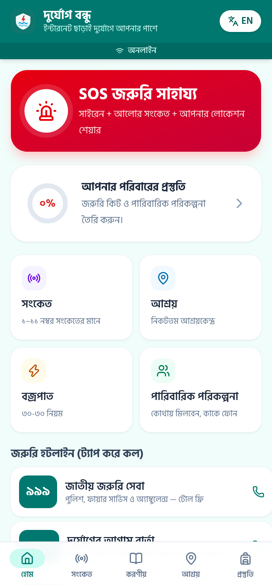
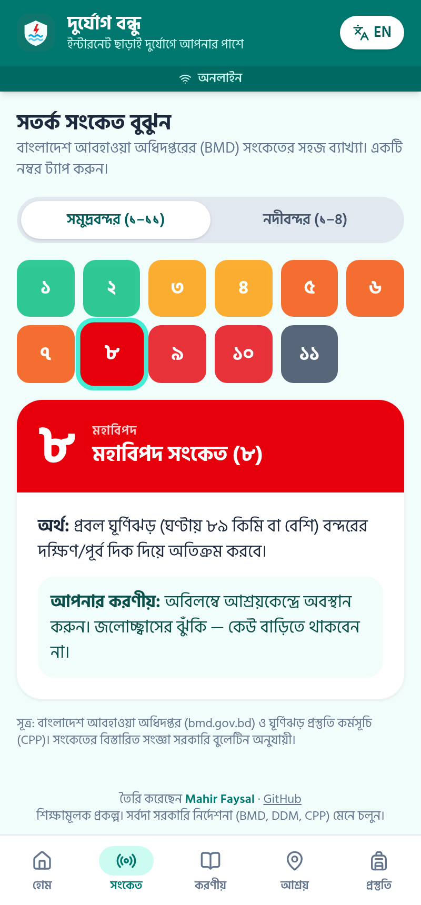
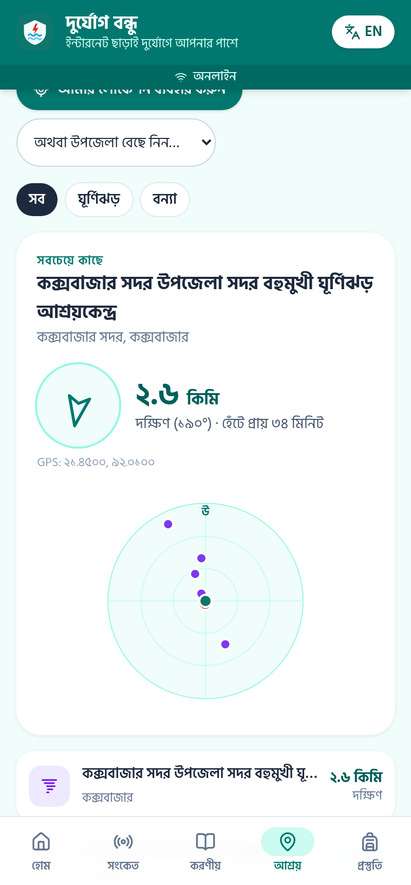
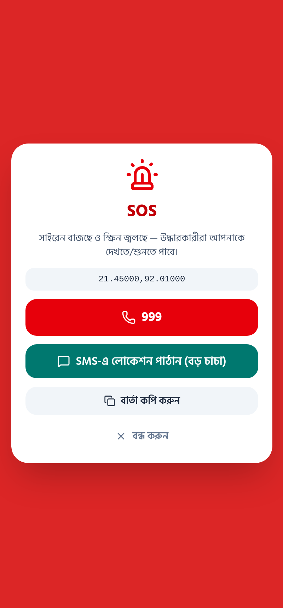
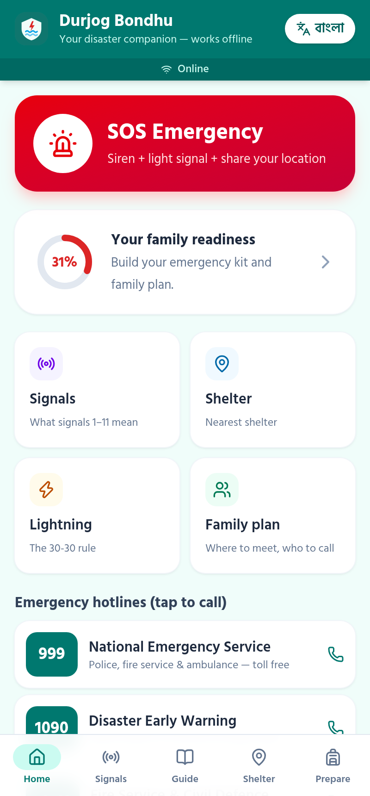
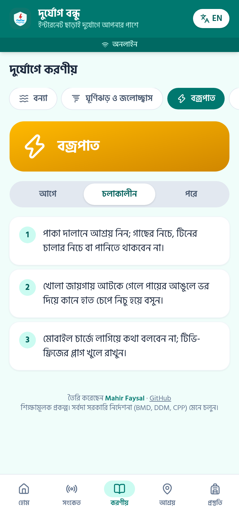
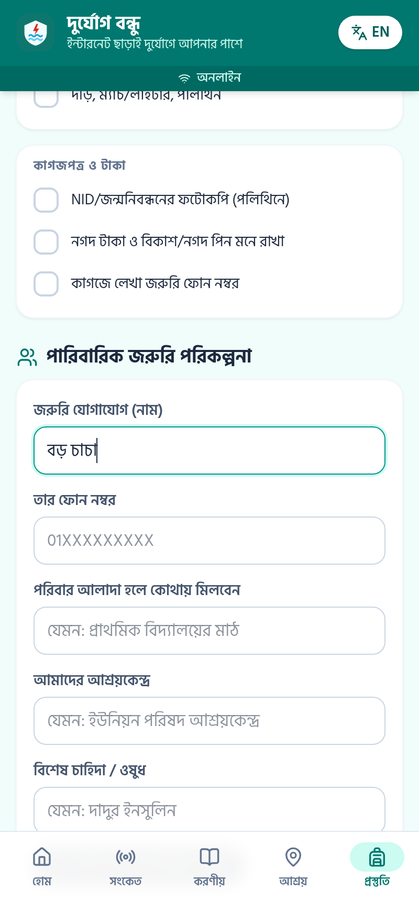
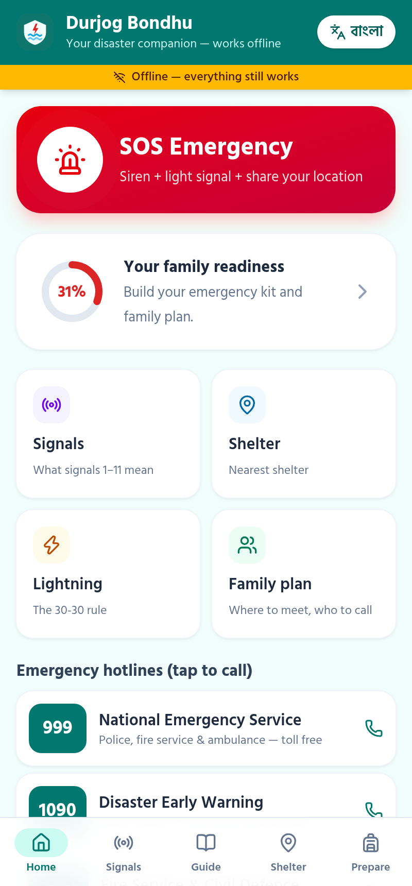
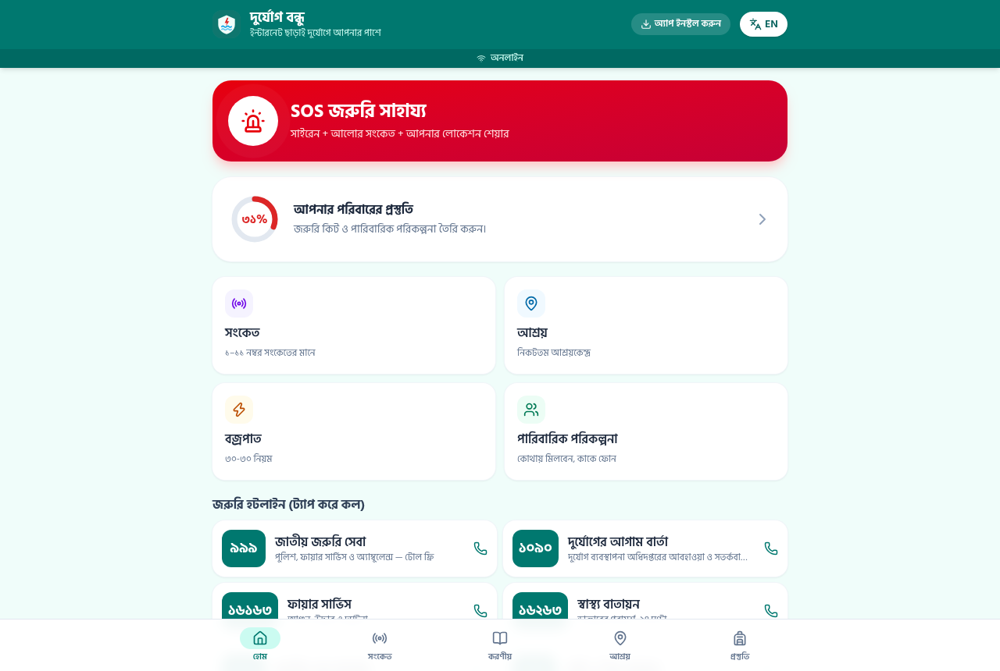

# দুর্যোগ বন্ধু — Durjog Bondhu

**An offline-first, Bangla + English disaster preparedness app for Bangladesh.**
Cyclone signal explainer, flood / cyclone / lightning / heatwave / earthquake safety guides, nearest-shelter finder that runs without internet, family emergency kit and plan, and a one-tap **SOS** mode with siren, flashing screen and location sharing over SMS.

🔗 **Live demo:** https://durjog-bondhu.vercel.app  ·  👤 Built by [Mahir Faysal](https://mfaysal.com) ([@mfaysal-dev](https://github.com/mfaysal-dev))

<p>
  
  
  
  
</p>

## The problem

Bangladesh is one of the most disaster-exposed countries on Earth: cyclones and storm surges hit the coast, the north-east and north go under water almost every monsoon, and lightning kills hundreds of people each year. When a disaster arrives, **mobile internet is usually the first thing to fail** — exactly when people need information most.

Many people also do not know what a signal number on the radio actually means for them ("৭ নম্বর বিপদ সংকেত — এখন কী করব?"), where their nearest shelter is, or what to pack.

## The solution

Durjog Bondhu is a **Progressive Web App (PWA)**. Open it once while online and it is cached on the phone — after that **every feature works with zero internet**, in **Bangla first** (with an English toggle), on any cheap Android phone.

| Feature | What it does | Works offline? |
|---|---|---|
| 🚨 **SOS mode** | Loud siren (Web Audio API), flashing red screen, vibration, GPS coordinates, one-tap call to 999 and an SMS with a map link to your family contact | ✅ (SMS uses the normal mobile network) |
| 📻 **Signal explainer** | All 11 maritime port signals + 4 river port signals, colour-coded by danger, with "what it means" and "what you should do" | ✅ |
| 📖 **Hazard guides** | Before / during / after checklists for flood, cyclone & storm surge, lightning (30-30 rule), heatwave and earthquake | ✅ |
| 📍 **Nearest shelter** | Uses the phone's GPS (which needs no internet), calculates distance with the **Haversine formula** and compass bearing on-device, shows an offline radar view and walking time | ✅ |
| 🎒 **Emergency kit** | 16-item checklist grouped by food, health, tools and documents | ✅ |
| 👨‍👩‍👧 **Family plan** | Emergency contact, meeting point, shelter, special medical needs — printable for the wall | ✅ |
| 📊 **Readiness score** | Live % score from kit + plan, so families can track preparation | ✅ |
| ☎️ **Hotlines** | 999, 1090, 16163, 16263, 333, 109 — tap to call | ✅ |
| 🔒 **Privacy** | No login, no server, no tracking. Everything is stored in `localStorage` on the user's own phone | — |

**No API keys, no paid services, no backend.** The whole app is static files.

## How it fits ICT Olympiad Bangladesh

ICT Olympiad Bangladesh Season 3's theme is **"প্রযুক্তির সাথে ক্ষমতায়ন" (Empowerment with Technology)**, and its segments include *Green Digitalization*, *ICT in Everyday Life & Society*, *Sustainable & Responsible Technology* and *Software & Application Development*. The gala round is judged by an ICT jury through practical work, viva and presentation.

Durjog Bondhu is a direct example of these ideas:

- **Empowerment with technology** — puts life-saving information in the hands of coastal and char communities, in their own language.
- **ICT in society / Smart Bangladesh** — supports the national disaster-management effort (BMD signals, DDM 1090 line, CPP volunteers) with a digital tool.
- **Sustainable & responsible technology** — offline-first, works on low-end phones, collects zero personal data.
- **Software engineering concepts for the viva** — PWA & Service Worker caching, Geolocation API, Haversine great-circle formula, Web Audio synthesis, responsive mobile-first design, i18n.

It also fits BCS ICT Fest 2026's **Project Showcasing → "Accessibility & Sustainability"** and **"Cloud, Data & Public Services"** tracks (judged on originality, functionality, scalability, impact and presentation).

## Tech stack

- **React 19 + TypeScript + Vite**
- **Tailwind CSS v4**
- **vite-plugin-pwa (Workbox)** — service worker precaches all assets for offline use
- **@fontsource/hind-siliguri** — self-hosted Bangla font (no Google Fonts request, works offline)
- **lucide-react** icons
- Browser APIs: Geolocation, Web Audio, Vibration, Clipboard, `sms:` / `tel:` links, `beforeinstallprompt`
- Deployed on **Vercel** as a static site

## Run locally

```bash
npm install
npm run dev      # http://localhost:5173
npm run build    # production build in dist/ (includes service worker)
npm run preview  # test the offline PWA build
```

To test offline: open the preview, then in DevTools → Network choose **Offline** and reload.

## Project structure

```
src/
  App.tsx            # all screens: Home, Signals, Guide, Shelter, Prepare, SOS
  lib.ts             # Bangla numerals, localStorage hook, Haversine + bearing maths
  data/content.ts    # hotlines, signals, hazard guides, kit items, shelter dataset
```

## Data & disclaimer

- Signal meanings are a simplified summary of the Bangladesh Meteorological Department's port warning signals. **Official BMD / DDM bulletins always take priority.**
- The shelter list is a **demo dataset**: points are approximate upazila-headquarter coordinates across coastal and flood-prone districts, not verified shelter addresses. Replace `shelters` in `src/data/content.ts` with an official DDM / Union Parishad list before real-world use.
- Educational project — not an official government service.

## Roadmap

- Import an official shelter list (CSV → JSON) for every upazila
- Offline vector map tiles for the coastal belt
- Audio guides in Bangla for low-literacy users
- Shareable family plan as a QR code

## Screenshots

| Home (EN) | Lightning guide | Prepare | Offline reload | Desktop |
|---|---|---|---|---|
|  |  |  |  |  |

## License

MIT © Mahir Faysal
